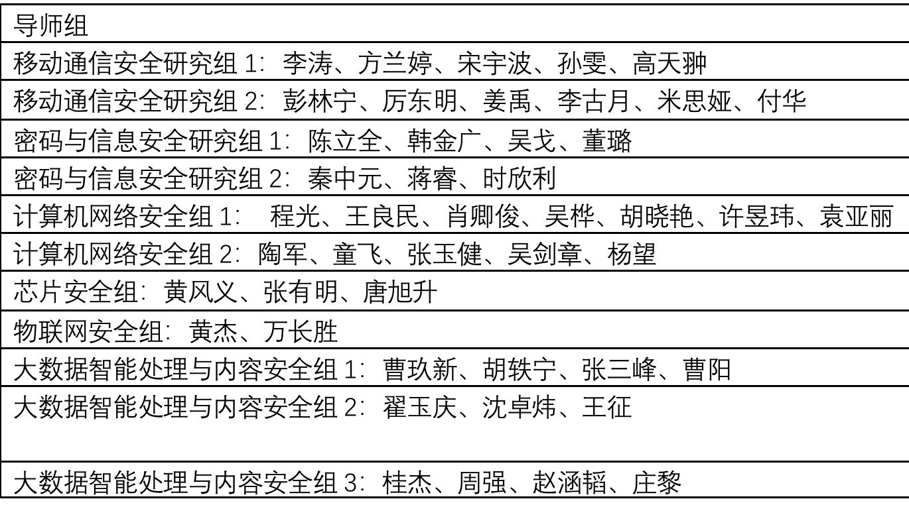

# 18-信息安全（密码学方向）-Solar1s-保研-@seu

## 个人背景

- 绩点排名：3.89+0.3	1/31

- 英语成绩：六级：482（夏令营报名时）、四级：573

- 竞赛经历：信息安全竞赛作品赛国二（夏令营时仅进入决赛）、省奖若干

- 科研经历：有小一年的实验室经历（欧嵬副教授 密码实验室）

- 论文：SCI四区水文二作（夏令营时已检索）

- 夏令营入营情况（未参加预推免）

  | 学校                         | 专业              | 结果                  |
  | ---------------------------- | ----------------- | --------------------- |
  | 北京大学（不知道当时咋想的） | 网络空间安全      | 未入营                |
  | 山东大学                     | 网络空间安全 学硕 | Get Offer             |
  | 武汉大学                     | 网络空间安全 学硕 | Get Offer             |
  | 东南大学                     | 网络空间安全 学硕 | Get Offer（最终去处） |

- 联系方式：QQ-1139317689，欢迎各位同学师傅们交流具体问题

## 山东大学

线上面试（约10min）：

1. 一分钟英文自我介绍
2. 提问：你能谈谈区块链吗？要求用英文作答（不过我当时好多专有名词不晓得，都是说中文hhh）
3. 提问：RSA加密算法的具体流程，其保证安全性的关键步骤是什么
4. 提问：简单谈谈你的科研经历
5. 提问：你接触过边缘计算吗，谈谈你的看法

总结：山大密码学实力有目共睹、面试节奏较快

## 武汉大学

考核方式：选拔考核综合成绩＝背景评估得分×40%+专业笔试成绩×20%＋综合面试成绩×40%（搜了下今年已经将笔试替换为英语听说）

线下笔试：50%（计算机网络+网络空间安全基础）+50%（C语言编程）

- 计算机网络考察较细（选择+名词解释+简答题），记得考察了链路层的某具体算法，公司组网、IP分配等基础知识
- 网安考察较为基础（选择+名词解释），如解释木马、DDoS攻击、缓冲区溢出等
- 编程（填空+补全代码+手写算法）考察较为基础，类似C语言和数据结构的期末试题

线下面试（一间教室大概有6、7位老师）： 

1. 英文提问：本科最敬爱的老师是谁，他对你有哪些影响；同组的朋友还被问了科研经历、学习情况等
2. 提问：本科阶段实现过哪些算法
3. 提问：讲讲你的科研经历
4. 后面就是根据科研经历随意提问，印象里提问了项目与论文中的算法创新点、相关概念、使用场景等

总结：武大国家网络安全学院基础设施一流，宿舍条件拉满；各研究所较为独立，研究方向五花八门：密码、病毒、二进制、物联网安全...；教务老师们也很友善，报账速度很快（宾馆免费、路费报销）；地理位置较偏僻。

## 东南大学

夏令营和预推免合办，会给根据填报材料分级：南京学硕、南京专硕、无锡专硕

考核方式：线上双选，宣讲后会公布每个导师的不同地区的招生名额，需要学生联系导师（每人可选择两位导师），由导师组织考核，考核方式多种多样，包括：无考核、电话面试、一对多小组面试、做项目验收成果等...

图1-东南大学网安学院各组导师（经供参考）

总结：简历初筛后的考核方式由具体导师决定

